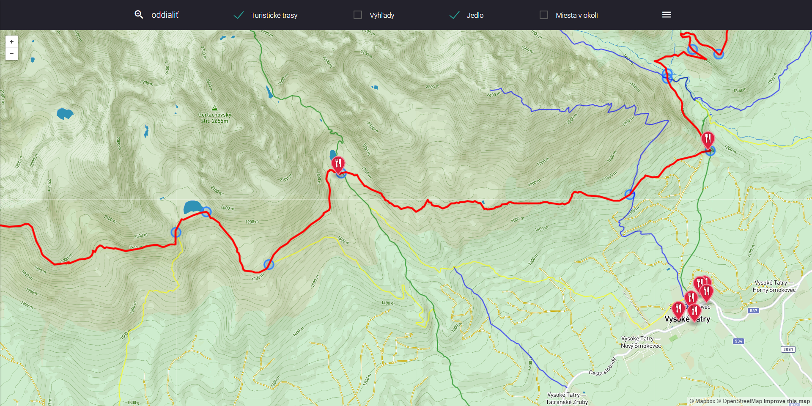
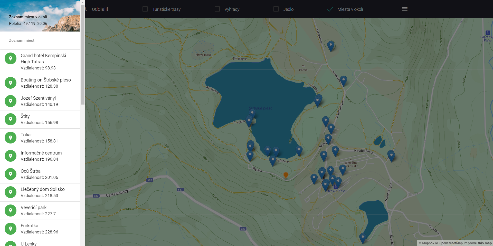
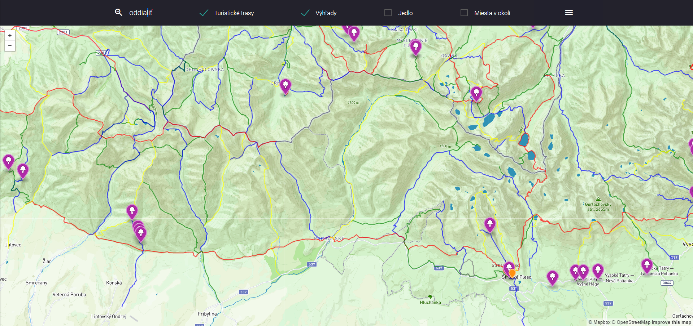

# Prehľad

Aplikácia je učená pre turistov,  ktorý navštívili vysoké tatry a majú záľubu vo vysokohorskej turistike Aplikácia preto ponúka:
- zobrazenie turistických trás pre Tatry
- vyhľadávanie miest v okolí podľa vzdialeností
- zobrazenie zaujímavých miest podľa turistického chodníka
- zobrazenie reštaurácií a výhľadov

Ukážka:





Aplikácia má 2 časti. Klient [frontend aplikácia](#frontend), ktorá používa knižnicu mapbox.js a [backend aplikácia](#backend) vytvorená v PHP frameworku [Laravel](https://laravel.com/), a PostGIS databáze. Komunikácia medzi frontend a backend aplikáciou je pomocou [REST API](#api).

# Frontend

Frontend aplikácia je postavená ako HTML stránka, ktorá využíva knižnice:
- [materializecss](https://materializecss.com),
- [jQuery](https://jquery.com),
- [mapbox.js](https://www.mapbox.com/mapbox.js/) - knižnica na na vykreslovanie mapy(založené na knižnici [leafleat](https://leafletjs.com)).

Aplikácia zobrazuje prispôsobenú mapu, ktorej je možné zobraziť, turistické trasy na vybranej lokalite a zaujímavé miesta v okolí. Vykreslovanie mapy je prispôsobené na lepšiu viditeľnosť ohraničenia národného parku a lokality, pre ktorú aplikácia slúži.

Všetka práca a manipulácia s mapou je zahrnutá z zdrojovom súbore `js/map-config.js`, ktorá je referencovaná z `index.html`. Z frontend aplikácie sa:
- určuje polohy používateľa,
- vykresluje mapa,
- zobrazuje bočný panel
- zobrazuje data z geojsonu.

# Backend

Backend aplikácia je postavená na PHP frameworku Laravel, ktorá poskytuje API na zobrazenie `geojson`. Dáta načítava z postgis databázy. 

## Data

Data predstavujú súbor turistických trás založenej na Open Street Maps DB schéme. Zdroj: [freemap.sk](http://wiki.freemap.sk/FileDownload). Obraz OSM obsahuje miesta, cesty, čiary, polygony z oblasti vysokých tatier. Obraz OSM z freemap.sk obsahuje mapu celého Slovenska približné 150MiB v osm.pbf formáte (Protocolbuffer Binary Format). Dáta som importoval cez `osm2pgsql` do štandardnej OSM schémy v WGS 84. Dáta som následné skúmal a orezal podľa požadovaj lokality cez nástroj QGIS. Na urýchlenie som použil index na geometry column (`way`). Komunikácia s databázou je zahrnutá v `app/http/controllers`. GeoJSON je generovaný funciou `st_asgeojson` a ďalej je upravovaný.

## Api

**Nájdi miesta v mojom okolí (lat, lng) a vo vzdialenosti**

`GET /api/place/{lat}/{lng}/{distance}`

**Zobraz všetky body na trase (id)**

`GET /api/hiking-route/{id}`

### Response

Volanie API vráti json, ktorý sa zobrazí do mapy, prípade do bočného panelu:
```
{
  "type": "Feature",
  "geometry": {
    "type": "Point",
    "coordinates": [
      20.2223745,
      49.1398383996577
    ]
  },
  "properties": {
    "building": null,
    "name": "Apartmány Central",
    "distance": "27.93808273"
  }
}
```

